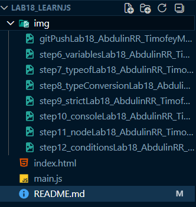

# Лабораторная работа №18. Введение в JavaScript. Сравнение с C#
Цель работы:
[X] Познакомиться с языком программирования JavaScript;
[X] Понять его место в web-разработке;
[X] Сравнить базовые концепции JavaScript и C#;
[X] Научиться запускать JavaScript-код в браузере и через Node.js.

## Основная информация
**ФИО:** *Абдулин Ринат Рушанович*
**Группа:** *ИСП-233*
**Дата:** *17.03.2026*

## Описание (что изучили)
- JavaScript (JS)
- Подключение JavaScript к HTML
- Переменные и типы данных в JavaScript
- Изменение типа переменной
- Типы данных
- Арифметические операции
- Константы (const)
- Проверка типов
- Явные и неявные преобразования
- Строгое и нестрогое сравнение
- Работа с консолью браузера
- Установка Node.js и запуск скрипта
- Условные операторы и логика в JavaScript

## Структура проекта
